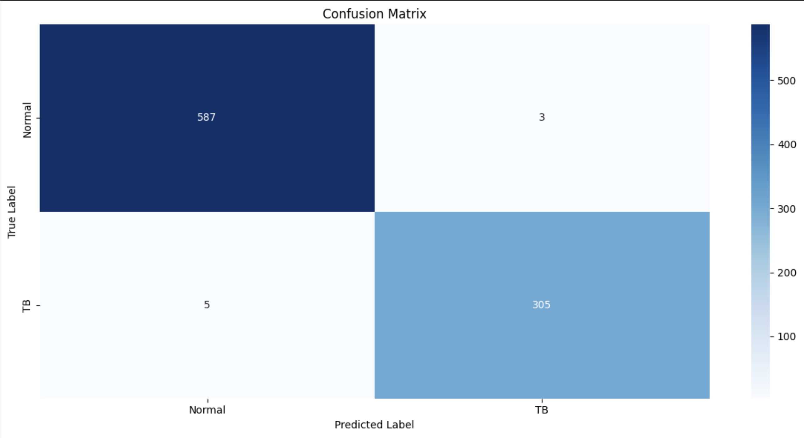
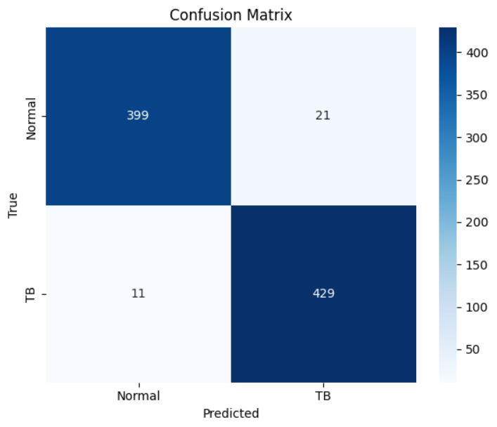

# Hi, We are Haris and Khubaib! Welcome to our Deep Learing Project 👋

[](https://choosealicense.com/licenses/mit/) 

# Deep Learning Project

The repository contains the following files:

* **UNetPretrained.ipynb** – Trains a UNet++ model for lung segmentation.
* **SEResNet50.ipynb** – Classifies TB from chest X-rays using SEResNet50.
* **UNet\_SENet.ipynb** – Combines UNet++ and SEResNet50 for segmentation-based classification.
* **SwinTransformer.ipynb** – Applies a Swin Transformer for TB classification.
* **Research Paper**

Dataset folders used in the notebooks:

* **Image-Segmentation/** – X-ray images and masks for segmentation.
* **Dataset2/**, **Dataset3/**, **Dataset4/** – X-ray images for TB classification.


## Table of Contents

1. [Introduction](#introduction)
2. [Installation Requirements](#installation-requirements)
3. [Project Overview](#project-overview)
4. [Data](#data)
5. [Training and Evaluation](#training-and-visualization)
6. [Screenshots](#screenshots)
   
## Introduction

This project includes implementing and comparing deep learning approaches for automated analysis of chest X-ray images. The models focus on segmenting lung regions and classifying the presence of Tuberculosis (TB) using a combination of CNN-based and Transformer-based architectures. Specifically, we train the following models:

1. **SENet** – A SEResNet50-based classifier trained directly on preprocessed raw chest X-rays.
2. **UNet++** – A segmentation model that isolates lung regions for cleaner downstream classification.
3. **UNet++ + SENet** – A two-stage pipeline where UNet++ segments lung areas, followed by SENet classification on the segmented output for improved diagnostic performance.
4. **Swin Transformer** – A Vision Transformer model applied to chest X-ray classification to explore attention-based learning.

Each notebook includes detailed preprocessing, training logic, evaluation metrics (Dice, IoU, classification reports), and GradCAM++ visualizations to interpret the model’s decision-making. This project demonstrates the effectiveness of combining segmentation and classification, and explores the use of Transformers in medical imaging.
 
## Installation Requirements

To run the notebooks in this repository, you will need the following packages:

* `numpy`
* `matplotlib`
* `seaborn`
* `opencv-python`
* `pillow`
* `torch`
* `torchvision`
* `timm`
* `albumentations`
* `scikit-learn`
* `tqdm`
* `segmentation-models-pytorch`
* `grad-cam`
* `torchsummary`

You can install these packages using pip:

```bash
pip install numpy
```

```bash
pip install matplotlib
```

```bash
pip install seaborn
```

```bash
pip install opencv-python
```

```bash
pip install pillow
```

```bash
pip install torch torchvision
```

```bash
pip install timm
```

```bash
pip install albumentations
```

```bash
pip install scikit-learn
```

```bash
pip install tqdm
```

```bash
pip install segmentation-models-pytorch
```

```bash
pip install grad-cam
```

```bash
pip install torchsummary
```

After installing the required libraries, simply run the **"Imports"** cell in each notebook to begin.

Useful Links for installing Jupyter Notebook:
- https://youtube.com/watch?v=K0B2P1Zpdqs  (MacOS)
- https://www.youtube.com/watch?v=9V7AoX0TvSM (Windows)

It's recommended to run this notebook in a conda environment to avoid dependency conflicts and to ensure smooth execution.
Also, you will need a GPU to run the notebooks. It is recommended to have a Google Colab Account (perhaps multiple accounts) for this purpose.
<h4> Conda Environment Setup </h4>
<ul> 
   <li> Install conda </li>
   <li> Open a terminal/command prompt window in the assignment folder. </li>
   <li> Run the following command to create an isolated conda environment titled AI_env with the required packages installed: conda env create -f environment.yml </li>
   <li> Open or restart your Jupyter Notebook server or VSCode to select this environment as the kernel for your notebook. </li>
   <li> Verify the installation by running: conda list -n AI_env </li>
   <li> Install conda </li>
</ul>


## Project Overview

Our project was executed over a period of approximately 1.5 months and consisted of the following five main phases:

#### 1. **Dataset Collection**

In this phase, we conducted extensive research to identify suitable datasets for our project. We curated a large collection of over 10,000 chest X-ray images from three different Kaggle datasets for classification tasks. Additionally, we sourced a dataset of 704 chest X-ray images with corresponding masks to train and evaluate our image segmentation models.

#### 2. **Baseline Model**

As our baseline, we implemented a **pretrained UNet++** model for lung segmentation. This model achieved a Dice Coefficient of 96%, providing a strong foundation for downstream classification tasks.

#### 3. **Improved Release**

In this phase, we developed a **SEResNet50** model — a Squeeze-and-Excitation ResNet architecture — for TB classification. The model demonstrated excellent performance, achieving 99% classification accuracy, along with strong results across all evaluation metrics.

#### 4. **Final Release**

We introduced a two-stage pipeline, where the UNet++ model first segmented the lungs, followed by classification using the SEResNet50 model. This integrated approach achieved an impressive 99% accuracy. Additionally, we experimented with a Swin Transformer, exploring transformer-based architectures for medical image classification. The Swin Transformer yielded strong performance, achieving a test accuracy of 96.28% and a test loss of 0.2156. Overall, the Swin Transformer achieved a macro average F1-score of 0.9627, indicating its effectiveness as a transformer-based alternative for TB classification.

#### 5. **Research Paper**

We concluded the project by writing a comprehensive **research paper** detailing our motivations, dataset preparation, methodology, model architectures, results, and analysis. This document serves as a complete overview of our approach and findings.


## Data

Our database consisted of the following four datasets. All of them were sourced from kaggle and are publicly available at the following links:

- Dataset 2: https://www.kaggle.com/datasets/tawsifurrahman/tuberculosis-tb-chest-xray-dataset
- Dataset 3: https://www.kaggle.com/datasets/usmanshams/tbx-11
- Dataset 4: https://www.kaggle.com/datasets/pritpal2873/chest-x-ray-dataset-4-categories

- Image Segmentation Dataset: https://www.kaggle.com/datasets/iamtapendu/chest-x-ray-lungs-segmentation


## Training and Visualization

The entire training process alongside the relevant evaluations and visualizations are explained in detail in the jupyter notebook. 


## Screenshots

<h4> 1. This image shows eight random samples of Chest X-ray images from the Image Segmentation dataset, with their masks ovelaid on top of the grayscale images. The masks are shaded red for better visualization.  </h4>
 <br> 

<h4> 2. This image shows the confusion matrix when the SEResNet50 classifier is evaluated on the test dataset containing raw Chest X-ray images. </h4>
 <br> 

<h3> 3. Swin Transformer </h3>
<h4> This image shows the confusion matrix when the Swin Transformer model is evaluated on the test dataset. </h4>

 <br> 
 
## License

[MIT](https://choosealicense.com/licenses/mit/)
